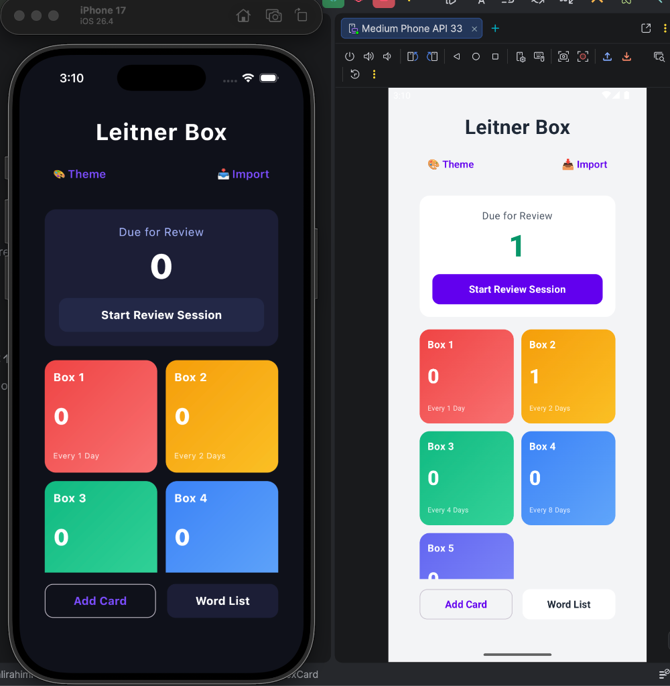
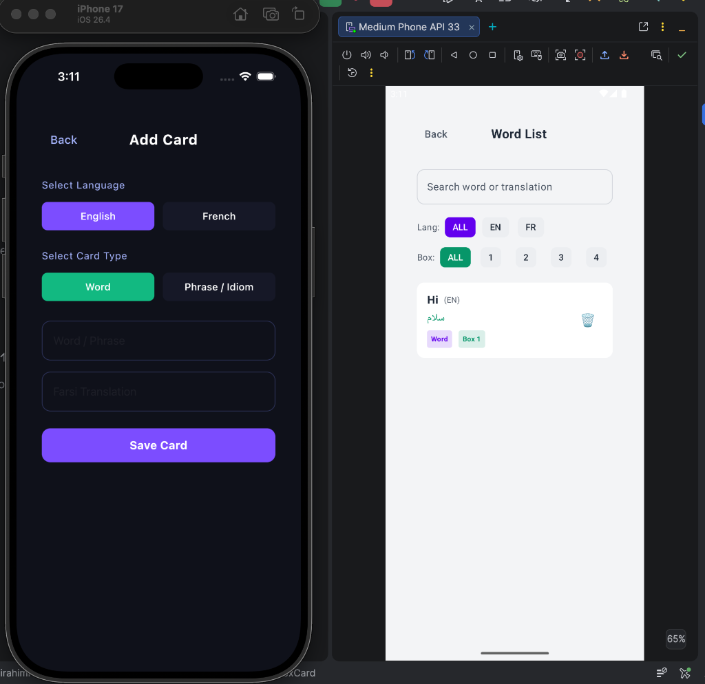

# FlashCard Learning (Leitner System)

An offline-first, modern Leitner Box spaced repetition flashcard application built using **Kotlin Multiplatform (KMP)** and **Compose Multiplatform**. It is specifically designed to help IELTS and language students memorize English and French vocabulary with Persian translations.

---

## Key Features

- **Leitner Spaced Repetition**: 5 progressive boxes with exponential delay intervals (1 day, 2 days, 4 days, 8 days, 16 days). Correct answers move cards forward, while incorrect answers reset them to Box 1.
- **Dynamic Keyboard Language Auto-Switching**: When adding cards, the device keyboard automatically switches to English/French when focusing on the vocabulary input, and to Persian when focusing on the translation field.
- **Bulk Word Import**: Import lists of flashcards in bulk. Users can copy-paste text (supporting separators like `->`, ` - `, `:`, and `=`) or pick `.txt` files directly using native file pickers on Android and iOS. Duplicates are automatically detected and skipped.
- **Improved UX & Polish**: Dismiss the keyboard automatically by tapping anywhere on the screen background. Review sessions feature smooth card transition animations without transition-flashing bugs.
- **Adaptive UI**: The dashboard, lists, and forms scale fluidly to provide a native, responsive experience on both phones and tablets.
- **Offline-First & Local Persistence**: Data is persisted locally using **SQLDelight** on SQLite, requiring zero internet connection or remote servers.
- **Clean Architecture & SOLID**: Strict separation of concerns (Domain, Data, Presentation, and UI layers) designed for robustness and testability.

## Screenshots

<p align="center">
  
  
</p>

---

## Architecture & Design Patterns

The codebase is designed using **Clean Architecture** combined with the **MVVM (Model-View-ViewModel)** presentation pattern, following strict SOLID design principles and developed using Test-Driven Development (TDD).

```
┌────────────────────────────────────────────────────────┐
│                        UI Layer                        │
│             (Dashboard, Add, Review, List)             │
└───────────────────────────┬────────────────────────────┘
                            ▼
┌────────────────────────────────────────────────────────┐
│                   Presentation Layer                   │
│                       (ViewModels)                     │
└───────────────────────────┬────────────────────────────┘
                            ▼
┌────────────────────────────────────────────────────────┐
│                      Domain Layer                      │
│             (Use Cases, Repository Interfaces)         │
└───────────────────────────┬────────────────────────────┘
                            ▼
┌────────────────────────────────────────────────────────┐
│                       Data Layer                       │
│        (Repository Implementation, SQLDelight DB)      │
└────────────────────────────────────────────────────────┘
```

- **Domain Layer**: Contains pure business logic and models. Uses distinct Use Cases (`AddCardUseCase`, `ReviewCardUseCase`, `GetCardsForReviewUseCase`, `GetAllCardsUseCase`) to encapsulate single responsibility actions.
- **Data Layer**: Implements repository interfaces and handles local persistence via SQLDelight.
- **Presentation Layer**: ViewModels manage UI states reactively using Kotlin Coroutines and StateFlows.
- **Dependency Injection**: Orchestrated using **Koin** for compile-time safety and clean platform-specific module bindings.

---

## Tech Stack

- **Framework**: Kotlin Multiplatform (KMP) & Compose Multiplatform
- **Database**: SQLDelight (with SQLite platform-specific drivers)
- **Dependency Injection**: Koin Core / Koin Compose
- **Concurrency**: Kotlin Coroutines & Flow
- **Serialization**: kotlinx.serialization

---

## Project Structure

```
├── androidApp         # Android Native Entry Point & Application
├── iosApp             # iOS Swift Entry Point & Xcode Project
└── shared             # Shared Kotlin Multiplatform Logic
    ├── src/commonMain # Shared UI Screens, ViewModels, Use Cases, Models, and DI Modules
    ├── src/androidMain# Android-specific SQLite driver & Context Helpers
    └── src/iosMain    # iOS-specific SQLite driver & Swift Koin Bridge
```

---

## Getting Started

### Prerequisites
- Xcode (for iOS build)
- Android Studio / IntelliJ IDEA with KMP plugin
- JDK 17+

### Running the Apps

#### Android Application
To build and assemble the debug APK:
```bash
./gradlew :androidApp:assembleDebug
```

#### iOS Application
1. Open `iosApp/iosApp.xcodeproj` in Xcode.
2. Select your target simulator (e.g., iPhone 17).
3. Click **Run** or use command line:
```bash
xcodebuild -project iosApp/iosApp.xcodeproj -scheme iosApp -configuration Debug -sdk iphonesimulator -destination "platform=iOS Simulator,name=iPhone 17" build
```

### Running Tests
The project was developed under strict Test-Driven Development. Unit and integration tests cover all Use Cases, ViewModels, and Repository implementations.

- **Run Android/JVM host tests**:
  ```bash
  ./gradlew :shared:testAndroidHostTest
  ```
- **Run iOS simulator tests**:
  ```bash
  ./gradlew :shared:iosSimulatorArm64Test
  ```

---

# جعبه لایتنر فلش کارت (Kotlin Multiplatform)

یک اپلیکیشن مدرن فلش کارت لایتنر (تکرار فاصله‌دار) آفلاین، توسعه داده شده با **Kotlin Multiplatform (KMP)** و **Compose Multiplatform**. این برنامه مخصوصاً برای کمک به دانشجویان آیلتس و زبان‌آموزان جهت یادگیری لغات انگلیسی و فرانسوی با ترجمه فارسی طراحی شده است.

---

## ویژگی‌های کلیدی

- **تکرار فاصله‌دار لایتنر**: دارای ۵ جعبه پیش‌رونده با فواصل زمانی نمایی (۱ روز، ۲ روز، ۴ روز، ۸ روز، ۱۶ روز). پاسخ‌های صحیح کارت‌ها را به جعبه بعدی هدایت می‌کنند و پاسخ‌های نادرست آن‌ها را به جعبه ۱ باز می‌گردانند.
- **تغییر خودکار زبان کیبورد**: هنگام وارد کردن کلمات، کیبورد به محض تمرکز روی فیلد کلمه به انگلیسی/فرانسوی و به محض تمرکز روی فیلد معنی به فارسی تغییر زبان می‌دهد.
- **ایمپورت گروهی لغات (Bulk Word Import)**: امکان وارد کردن انبوه فلش‌کارت‌ها. کاربران می‌توانند لیست کلمات را مستقیماً کپی و پیست کرده (با جداکننده‌های مختلف مانند `->` یا ` - ` یا `:` یا `=`) یا فایل متنی `.txt` را از طریق انتخابگر نیتیو فایل در اندروید و iOS انتخاب کنند. کلمات تکراری در زبان هدف به طور خودکار شناسایی و نادیده گرفته می‌شوند.
- **بهبود تجربه کاربری و پولیش رابط کاربری**: قابلیت بستن خودکار کیبورد با لمس هر نقطه خالی از صفحه (Clear Focus on Tap) و انیمیشن انتقال نرم بین کارت‌ها در جلسات مرور بدون مشکل فلاش زدن موقت پاسخ کارت بعدی.
- **رابط کاربری تطبیق‌پذیر (Adaptive)**: داشبورد، لیست‌ها و فرم‌ها به صورت کاملاً ریسپانسیو و متناسب با ابعاد گوشی و تبلت مقیاس‌دهی می‌شوند.
- **کاملا آفلاین (Offline-First)**: داده‌ها به صورت محلی با استفاده از **SQLDelight** بر روی دیتابیس SQLite ذخیره می‌شوند و نیاز به اتصال اینترنت یا سرور ندارند.
- **معماری تمیز و اصول SOLID**: تفکیک کامل مسئولیت‌ها در لایه‌های Domain، Data، Presentation و UI برای افزایش پایداری و تست‌پذیری برنامه.

## تصاویر برنامه

<p align="center">
  
  
</p>

---

## معماری و الگوهای طراحی

این پروژه با بهره‌گیری از **معماری تمیز (Clean Architecture)** همراه با الگوی ارائه **MVVM (Model-View-ViewModel)** و رعایت اصول شی‌گرایی SOLID توسعه یافته است.

- **لایه دامنه (Domain)**: شامل منطق خالص تجاری و مدل‌ها است و از Use Caseهای مجزا برای اجرای هر عملیات استفاده می‌کند.
- **لایه داده (Data)**: رابط‌های مخزن (Repository) را پیاده‌سازی کرده و ذخیره‌سازی محلی را از طریق SQLDelight مدیریت می‌کند.
- **لایه ارائه (Presentation)**: کلاس‌های ViewModel وضعیت رابط کاربری (UI State) را با استفاده از Coroutines و StateFlow کنترل می‌کنند.
- **تزریق وابستگی**: با استفاده از فریم‌ورک محبوب **Koin** جهت ماژولار ساختن و مدیریت وابستگی‌های پلتفرم‌ها انجام شده است.

---

## نحوه اجرا و تست

### پیش‌نیازها
- سیستم‌عامل macOS با Xcode نصب شده (برای ساخت نسخه iOS)
- محیط Android Studio یا IntelliJ IDEA با پلاگین KMP
- جاوا نسخه JDK 17+

### اجرای برنامه‌ها

#### نسخه اندروید:
```bash
./gradlew :androidApp:assembleDebug
```

#### نسخه iOS:
پروژه موجود در مسیر `iosApp/iosApp.xcodeproj` را در Xcode باز کرده و اجرا کنید، یا از دستور زیر در ترمینال استفاده نمایید:
```bash
xcodebuild -project iosApp/iosApp.xcodeproj -scheme iosApp -configuration Debug -sdk iphonesimulator -destination "platform=iOS Simulator,name=iPhone 17" build
```

### اجرای تست‌ها
پروژه تحت متدولوژی TDD پیاده‌سازی شده و دارای پوشش کامل تست‌های واحد و یکپارچه‌سازی است.

- **اجرای تست‌های اندروید/JVM**:
  ```bash
  ./gradlew :shared:testAndroidHostTest
  ```
- **اجرای تست‌های شبیه‌ساز iOS**:
  ```bash
  ./gradlew :shared:iosSimulatorArm64Test
  ```